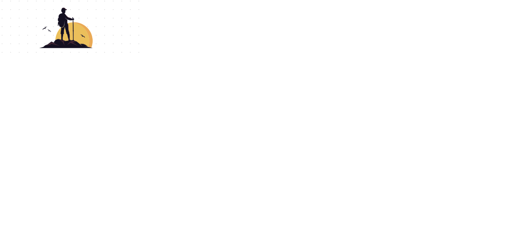

  
  
   

  <h3><b>README</b></h3>

<!-- PROJECT DESCRIPTION -->

# 📖 [Hello Microverse] 

> This is Day 2 project for learning Git workflows. I aim to follow the instructions as mentioned in the task board and set up this repo.

<!-- Features -->

### Key Features 

> This project catered to understand how to create a repo. Create branches with different base branches. Understand the concept of version control. Follow GitHub flow. Open pull requests in GitHub. Write descriptive, easy to understand commit messages. Write short, detailed, easy to understand descriptions of pull requests. Write a descriptive and easy to understand README in business English for every project submitted. Demonstrate an ability to submit a project for code review.

- **[Follow GitHub flow]**
- **[Open pull requests in GitHub]**
- **[Demonstrate an ability to submit a project for code review]**

(<a href="#readme-top">back to top</a>)

<!-- LIVE DEMO -->

## 🚀 Live Demo 

> Live link is coming soon..

- [Live Demo Link](https://google.com)

(<a href="#readme-top">back to top</a>)

<!-- AUTHORS -->

## 👥 Author 

> 

👤 **Sandeep**

- GitHub: [@mailsg](https://github.com/mailsg)

(<a href="#readme-top">back to top</a>)

<!-- LICENSE -->

## 📝 License 

This project is [MIT](./LICENSE.md) licensed.

(<a href="#readme-top">back to top</a>)

